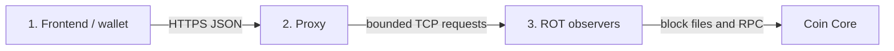

# CC-WALLET

> **Canonical source:** https://git.communitycoins.org/Communitycoins.Rooty/CC-WALLET  
> Mirrors on GitLab or GitHub may be read-only and may lag behind.

CC-WALLET is a non-custodial browser wallet for legacy CommunityCoin networks.
It creates and restores deterministic wallets, derives addresses, builds and
signs transactions locally, and obtains blockchain state through infrastructure
operated by the participating coin communities.

The project started in 2023. A broad multicoin prototype was completed in
January 2024 and development resumed in August 2026. The current work is not a
cosmetic upgrade of that prototype: it establishes a new, deliberately narrow
foundation on which additional coins can be enabled one at a time.

## Clean installation

The wallet and proxy form one webroot. On a host where `/var/www` is the web
directory, a clean checkout is enough for the public files:

```sh
cd /var/www
git clone https://github.com/communitycoins/CC-WALLET.git
install -d -m 0700 -o www-data -g www-data /var/www/CC-PROXY
```

Point the HTTPS virtual host at `/var/www/CC-WALLET`. The webroot itself only
needs to be readable by the web server; the sibling `CC-PROXY` directory must
be writable by it and must never be published. PHP 7.3 or newer is required.
The `curl` command is useful for operational checks, but it is not a browser
wallet dependency. ROT runs externally beside Coin Core and requires its own
Docker installation.

An operator with an existing clean checkout migrates the wallet webroot with
one Git command:

```sh
git -C /var/www/CC-WALLET pull --ff-only
```

The private sibling `/var/www/CC-PROXY` is not part of the checkout and is
therefore preserved. Local changes in the public checkout must be committed or
removed before this fast-forward update can succeed.

`operator-config.json` is optional. If absent, `proxy.php` derives the primary
coin from the root domain (`egulden.org` and `e-gulden.org` → EFL,
`auroracoin.is` → AUR, `canadaecoin.ca` and `ourcoin.ca` → CDN, and
`deutsche-emark.org` → DEM); unknown domains default to AUR. To override that
policy, copy `operator-config.example.json` to
`/var/www/CC-PROXY/operator-config.json`, edit it, make it owned by the web
server and ensure it is not group- or world-writable.

On first contact, an unplanned proxy is stored centrally as `CANDIDATE`. A
centrally pre-announced `PROSPECT` becomes `OK` automatically when it contacts
the bootstrap. A candidate becomes operational only after the central operator
changes its status to `OK` in `proxy-directory.json`. Only `OK` proxies are
published to wallets and accepted for CORS; the status does not alter ROT.php
or invalidate ROT registrations that a proxy already holds.

The browser bundle includes Bootstrap 5.3.2 and Bootstrap Icons 1.11.2 locally.
There is deliberately no service worker in this release; upgrades use the
`CC-WALLET-031` query key on the wallet JavaScript, CSS and selected language
table.

### Hourly network metrics and seven-day detail

`proxy.php` writes full operational events to UTC-dated files below the private
`network-logs` directory. It retains the current date and six preceding dates;
the fixed `network.log` left by an earlier release is no longer extended and is
removed seven days after its last modification.

Every completed request also updates a locked accumulator below
`network-hours`. After the hour closes, the next request serializes the summary
and active-coin rows as compact pipe-separated integers. The record contains
request outcomes and payload-byte totals for wallet, directory, registration,
ROT and central traffic; it never contains addresses, transaction IDs, raw
transactions or request bodies. Byte fields measure application payloads, not
HTTP or TLS framing.

At shutdown `proxy.php` acquires the private `network.hour` sender watch
non-blockingly. Under PHP-FPM, `fastcgi_finish_request()` releases the browser
response before the bounded HTTPS submission begins. A failed submission keeps
the completed accumulator and is retried after five minutes. A successful
submission removes only that already accepted local accumulator; the seven-day
detailed logs remain available for operator diagnosis.

### X-help configuration collection

Each proxy validates its public `tweets.json`, normalizes the configured help
links and keeps the last accepted digest in the private `xhelp.report` watch.
The first ordinary request after a semantic content change reports the new
configuration after releasing the wallet response. Failed reports remain
pending and retry after one minute; an absent or invalid file only produces a
rate-limited local warning.

The installation hostname (`proxyId`) is the archive identity. The bootstrap
accepts a report only when the exact reporting proxy URL currently has status
`OK` and stores the normalized configuration atomically as
`CC-PROXY/xhelp/<proxyId>/tweets.json`. X-help configuration is deliberately
independent of `primaryCoin`; any optional team or coin grouping belongs in the
monitor presentation layer.

X-help reporting is fail-open and has no effect on wallet routing. As with the
hour metrics, the digest provides content integrity and idempotence but not
sender authentication; `proxyId` remains operational metadata claimed by an
`OK` proxy URL.

### Routeable directory coverage

The protocol-1 field `registeredRots` is retained for compatibility, but its
directory value represents ROTs that the reporting proxy can currently route
to. Candidate, recovering, quarantined, stale and backed-off registrations do
not make a proxy eligible for wallet failover.

Each proxy keeps a private `proxy-directory.report` digest watch. A changed
coverage digest is reported to the bootstrap only after the triggering client
response has completed. A failed report leaves the successful digest unchanged
and is retried after one minute by the next ordinary proxy request. Unchanged
ROT status traffic performs no central hello. Bootstrap directory mutations
are serialized through the private `proxy-directory.lock` file.

A satellite answers `proxyDirectory` from its validated local copy while that
copy is less than one hour old. Only a stale or missing copy triggers a
synchronous central hello. When that attempt fails, the older validated copy
remains the availability fallback. Bootstrap-local requests never perform an
external directory fetch.

## Release number and language roadmap — 19 September 2026

CC-WALLET-031 shows `Version 1.0` on a separate centered line below the product
name in Wallet Help. The corresponding first Git release tag is `v1.0.0`.
Git tags follow `vMAJOR.MINOR.PATCH`; the wallet deliberately shows only
`MAJOR.MINOR` so an operational bug-fix build does not turn the Help screen
into release engineering information.

This compatible patch also closes an open Receive or Send panel before the
Balance dialog changes coin, reports the calculated tiered fee beside an
insufficient-balance message, and moves the balance-privacy control above the
amount so it cannot hide the final digits.

- `PATCH` is increased for compatible bug fixes, performance work and wording
  or translation corrections.
- `MINOR` is increased when another coin becomes fully supported and visible.
- `MAJOR` is reserved for a breaking wallet, storage or network-contract
  change.

The language selector always shows the committed roadmap: English, Dutch,
Icelandic, German, Portuguese, Russian, Spanish, Japanese, Polish, French and
Urdu. English through Russian are bundled and selectable. Spanish, Japanese,
Polish, French and Urdu remain visible but disabled while their corresponding
`js/language_<code>.js` file is absent. The selector checks those files without
using the release cache, so installing a future package enables it without a
change to `rooty.js` or a new wallet-code release. A stored or URL-requested
language whose file cannot be loaded falls back to English and clears that
unusable choice.

Portuguese and Russian now cover the same 167-key current-interface completion
scope as the Icelandic completion round, including settings, Help, wallet
management, backup, Receive and transaction dialogs, plus the current PIN and
privacy controls. Native speakers should still review tone and terminology
before the release tag is signed; package completeness is not a substitute for
language review.

## Status — 29 August 2026

- **EFL (eGulden)** is the first complete end-to-end wallet slice. Wallet
  creation and recovery, Receive, confirmed state, history, local transaction
  construction and signing, broadcast, transaction status, and optional
  zero-confirmation observation are connected and covered by regression tests.
- **DEM (Deutsche eMark)** is the first multicoin extension. ROT 0.8.2 is
  operational; state, history, and transaction-status responses have been
  verified. The bitcoinjs fork now supports DEM's timestamped transaction
  format and its CompactSize transaction comment. The DEM gateway,
  `stateService` activation, and a small real Send/Receive cycle are still to be
  completed before DEM appears as an operational wallet coin.
- **AUR and CDN** are the next intended wallet targets. Their presence in the
  prototype or calculator does not yet mean that the complete current wallet
  path is enabled.
- Other coin definitions and earlier ROT experiments remain useful research,
  but they are not a support claim. A coin is exposed by the wallet selector
  only after its complete derivation, state, history, fee, signing, broadcast,
  and recovery path has been tested.

## Why the architecture changed

The 2024 prototype depended heavily on Electrum and ElectrumX. Electrum is a
proven ecosystem, but for small CommunityCoin networks the practical situation
was difficult:

- few compatible servers existed and their availability varied;
- browser clients needed an additional WebSocket or HTTPS bridge;
- maintaining coin-specific ElectrumX installations required substantial
  Python infrastructure;
- the wallet needed only a small part of the full Electrum protocol;
- differences between old coin Cores repeatedly required local compatibility
  work;
- server discovery alone did not provide the operational assurance or
  observability needed by these small networks.

CC-WALLET no longer uses Electrum in its active wallet path. This is not a claim
that ROT is a universal replacement for Electrum. It is a purpose-built choice
for the constrained legacy-P2PKH scope of CommunityCoins. It gives the project
control over the exact data contract and coin adaptations, but also transfers
responsibility for operating, monitoring, measuring, and replicating the
services to us.

The browser-to-Core path requires JavaScript in the wallet and PHP for the
proxy and ROT services; it has no Python runtime dependency.

## Three-layer foundation



Coin Core is the authoritative network implementation behind ROT; it is not a
fourth CC-WALLET application layer.

| Layer | Responsibility |
| --- | --- |
| **Frontend / wallet** | Holds the wallet locally, derives keys and addresses, validates state, selects inputs, constructs and signs transactions, verifies the signed result, and presents Receive, Send, history, and payment observations. |
| **Proxy** | Provides one bounded HTTPS interface, validates requests and responses, routes or fails over between ROT instances, rejects inconsistent data, aggregates optional observers, and records timing and payload measurements. |
| **ROT — RingOfTrust** | Maintains a compact per-coin legacy index, returns checkpoint-bound state and history, asks Core to broadcast already-signed transactions, and reports confirmed or mempool transaction status. |

This separation is important: ROT and the proxy never need the mnemonic or a
private key, and neither service constructs or signs a payment.

## Current wallet capabilities

### Local wallet lifecycle

- Local BIP39 entropy is generated with the browser Web Crypto API.
- New ROOTY wallets use twelve English BIP39 words.
- Imported English BIP39 mnemonics may contain 12, 15, 18, 21, or 24 words.
- An optional BIP39 recovery passphrase is supported and remains distinct from
  the mnemonic.
- Multiple wallets, switching, backup recovery, PIN flow, and deliberate wallet
  deletion are present.
- Wallet changes are serialized through IndexedDB transactions so the user
  interface does not continue before a database commit finishes.
- Mnemonics and private keys are not sent to the proxy, ROT, or Core.

### EFL derivation and addresses

- BIP44 path: `m/44'/78'/0'/0/index`
- Legacy P2PKH addresses and signing
- Change address at index `0`
- Rotating Receive addresses at indices `1` through `50`
- Canonical payment URI scheme: `e-gulden:`

On seed-only recovery the wallet scans the configured range once. A historical
wallet that used addresses beyond index 50 therefore needs a future extended
discovery mechanism.

### Confirmed state

The wallet derives the change address and the active Receive range and requests
them together. ROT returns one atomic snapshot with a chain height, block hash,
per-address last-change height, balance, and UTXOs. The proxy validates the
complete response before the wallet may use it.

After the initial full snapshot, the wallet can request and merge only address
records changed since the known checkpoint. Confirmations are recalculated
locally against the returned height. Spendable UTXOs remain memory-only and
expire independently of the displayed cached balance; stale or malformed state
therefore fails closed for Send.

The ordinary refresh schedule is activity-driven instead of continuous. It
wakes for startup, wallet selection, Receive, Send, and renewed visible use,
then sleeps after the focus period.

### Send

For EFL the browser:

1. validates the destination and exact eight-decimal amount;
2. selects confirmed inputs from one checkpoint-bound snapshot;
3. derives the corresponding private key for every input;
4. builds and signs a legacy P2PKH transaction locally;
5. independently verifies inputs, outputs, change, fee, signatures, and txid;
6. asks for explicit broadcast confirmation from the user;
7. submits only the signed raw transaction and locally calculated txid;
8. follows broadcast with transaction-status and confirmed-state checks.

Accepted input outpoints remain locked locally while confirmation is pending.
An exact spend produces no zero-value change output.

The current EFL policy charges `100000` satoshi per started group of six legacy
inputs. That rule is intentionally visible in the coin service configuration.
Fee policy, display units, URI scheme, network bytes, and transaction-format
quirks belong in a complete coin specification rather than in generic wallet
logic; this will be tightened while integrating DEM.

### Receive and payment observation

Receive creates a QR from the exact held address and optional amount. After a
broadcast, the sender can show a compact versioned payment-confirmation QR. The
recipient may scan it and ask independent ROT positions whether they have seen
the exact `txid + address + amount` output.

These observations are deliberately separate from wallet state:

- partial observer results can be shown immediately;
- an observation never increases confirmed balance;
- an observed output is never spendable;
- only inclusion in the blockchain produces confirmation and final wallet
  history.

With one available ROT, the honest result is simply “1 of 1 observers has seen
the transaction.” Redundancy improves availability and the usefulness of the
observation, but observer count is not blockchain consensus.

### History

ROT returns confirmed incoming outputs and external outgoing payments for one
atomic wallet address set. Wallet change is excluded. Each event includes its
canonical block height and timestamp. The initial confirmed history is imported
once and stored in IndexedDB; later confirmed Send and Receive events are added
locally. Pending presentation remains runtime state and is not promoted to
permanent history before confirmation.

ROT 0.8.2 resolves timestamps in bounded Core RPC batches. The wallet still
needs a small presentation update to show the year for older EFL, AUR, and DEM
wallet histories; the timestamp itself already comes from ROT.

### Calculator and price information

The original multicoin calculator remains part of the wallet. It separates a
personal reference asset, familiar fiat value, and the active wallet coin.
Price information assists presentation only: it has no authority over balances,
UTXOs, transaction construction, or confirmation.

## ROT in brief

ROT is a PHP service beside a coin Core. It builds compact in-memory indexes for
legacy transactions, public-key hashes, and transaction outputs. Historical
blocks are read from Core block files; RPC is used where Core owns the freshest
or additional information, including broadcast, mempool status, and block
timestamps.

The current contract provides:

- service statistics and indexed height;
- atomic multi-address state (`pubs`);
- confirmed address history (`history`);
- raw-transaction broadcast (`send`);
- transaction confirmation or mempool status (`txstatus`);
- exact-output zero-confirmation observation.

The index maintains rollback checkpoints and can rewind to the highest valid
canonical checkpoint after a tip reorganisation. Index pointers, duplicate
outpoints, cycles, address versions, response sizes, and checkpoint consistency
are checked before data is accepted.

ROT intentionally indexes only legacy P2PKH activity. Coinbase transactions,
SegWit, script types other than P2PKH, and arbitrary smart-contract data are
outside the present scope.

## DEM integration

Deutsche eMark confirmed that the architecture can absorb a coin-specific
transaction format without changing the three layers. Its relevant parameters
are:

- P2PKH version byte: `53`
- WIF version byte: `0xb5`
- BIP44 coin type: `1500`
- timestamped proof-of-stake transaction format
- CompactSize transaction comment, normally empty

The maintained bitcoinjs 3.3.2 PoS fork now reads and writes the DEM comment
before its end-of-transaction check, preserves it while cloning and signing,
and enables the behavior only for networks with
`hasTransactionComment: true`. Other coin serializers therefore remain
unchanged.

DEM ROT 0.8.2 has returned valid state, historical timestamps, and confirmed
transaction status. Remaining activation work is deliberately small and
coin-specific: deploy a DEM proxy, add its `stateService` and fee/unit policy,
run seed-recovery and fixed raw-transaction vectors, and complete one real
Send/Receive/zero-confirmation loop.

The fork is maintained at:
https://github.com/communitycoins/bitcoinjs-lib.3.3.2-pos

The broader inventory of envisioned CommunityCoin networks remains available
at: https://gitlab.com/c4319/cc-index

## Trust and security boundaries

CC-WALLET is non-custodial, but non-custodial does not mean trustless.

- Keys and signing stay in the browser.
- The proxy constrains and validates the network interface.
- Atomic checkpoints prevent the wallet from combining UTXOs from different
  snapshots.
- Multiple ROT services can provide failover and independent transaction
  observations.
- ROT data is not currently accompanied by Bitcoin-style header and Merkle
  proofs verified by the browser. A dishonest or compromised data service can
  still misreport chain state even though it cannot sign a transaction.
- The integrity of the delivered browser code is security-critical: software
  served by the wallet origin can access an unlocked wallet.
- Users remain responsible for recovery words, passphrases, destination
  addresses, selected networks, and irreversible transactions.

The old README proposed a rolling hash as “proof of trust.” That proposal is
not presented here as an implemented security property. The current protection
comes from narrow contracts, checkpoint consistency, local transaction
verification, service redundancy where available, and observable operations.

## Performance and operations

State traffic is bounded by address limits, delta snapshots, short timeouts, and
activity-driven polling. History is different: resolving old transaction dates
requires Core block metadata and the cost grows with a wallet's actual history.
New wallets normally begin with none, and users may deliberately empty and
delete wallets, but total-system load must be measured rather than assumed.

The EFL proxy currently uses a 30-second ROT history timeout and the wallet a
45-second request timeout. These are operational starting points, not protocol
truths. Network logs record route, attempts, request and response bytes, total
relay time, and outcome so that limits can be based on measurements.

Service health can be monitored at:
https://communitycoins.org/rots/

EFL currently has multiple configured ROT positions. DEM began with one. The
next operational phase is to measure real use, identify slow history patterns,
and add redundancy or adjust limits where the evidence requires it.

## Known boundaries

- The 1.0 interface exposes EFL, AUR, CDN and DEM. PAK remains hidden until its
  full derivation, state, history, payment and restart path has passed the same
  end-to-end acceptance gate.
- Legacy P2PKH is a deliberate compatibility boundary, not a temporary claim
  of support for every output type.
- Address discovery is presently bounded at index 50.
- Zero-confirmation is an observation, never confirmed or spendable state.
- Fee selection is currently a conservative per-coin tier rule rather than a
  general byte-accurate estimator.
- History timestamps are available, but the ordinary history view does not yet
  show the year.
- Redundancy varies by coin; one ROT is one observer, not a quorum.
- Reorganisation recovery exists in ROT but still deserves continued live-chain
  and failure testing.
- Browser deployment, reproducible dependency builds, device testing, load
  measurement, monitoring, and recovery documentation require further
  production hardening.

## Near-term route

1. Bring PAK online behind the existing interface and keep it hidden until its
   derivation, state, history, Send, Receive, restart and recovery path passes.
2. Upgrade one PAK ROT first, observe registration and health, then add further
   ROTs individually without changing the 1.0 user interface.
3. Review the new Portuguese and Russian tables with their coin teams and
   prepare complete `es`, `fr`, `pl`, `ur` and `ja` language tables. All five
   commitments are already visible but disabled in the selector. Urdu also
   requires right-to-left layout tests; Japanese requires font, line-breaking
   and narrow-screen checks.
4. Measure state and history load, then add ROT/proxy redundancy and tune limits
   from observed data.
5. Continue deployment, backup/recovery, reorganisation, hostile-input and
   device testing before describing CC-WALLET as production-ready.

## Development checks

The current EFL slice includes a Node-based regression harness covering wallet
state, seed recovery, address derivation, Receive, Send planning, signatures,
broadcast contracts, zero-confirmation behavior, confirmed history, backup,
wallet deletion, and operational coin filtering.

For an extracted EFL-SLICE release:

```bash
node --check wallet/rooty.js
node --check wallet/js/language_nl.js
node --check tests/EFL-SLICE-054-wallet-test.js
node tests/EFL-SLICE-054-wallet-test.js
```

Passing local tests is necessary, but it does not replace a small real-value
network cycle for each newly enabled coin.

## Project principle

The objective is not to reproduce every Bitcoin wallet feature. It is to make a
small, understandable, and maintainable payment path for sovereign community
currencies:

> derive locally, sign locally, verify locally, expose only confirmed state as
> spendable, and keep every network dependency narrow and observable.
